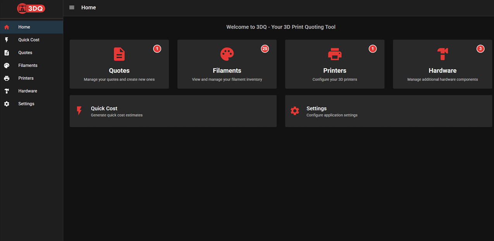
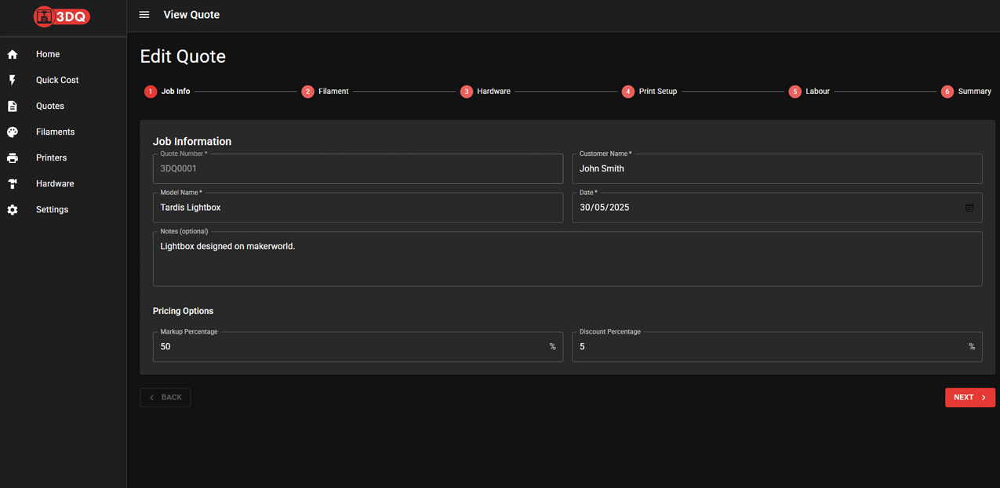
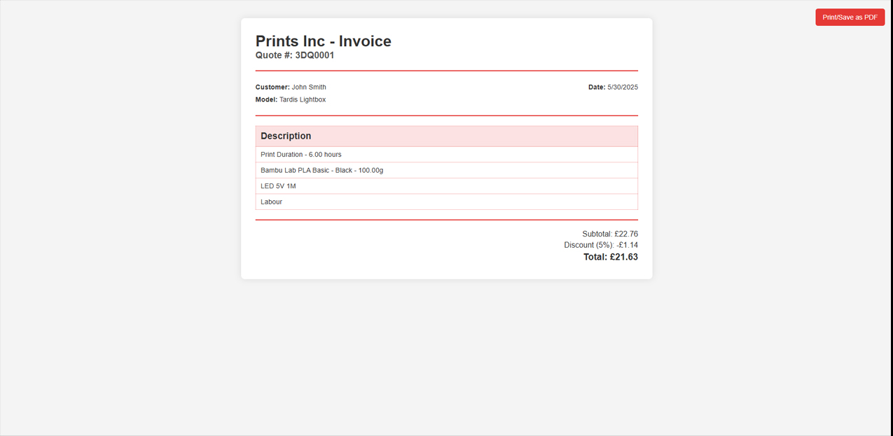
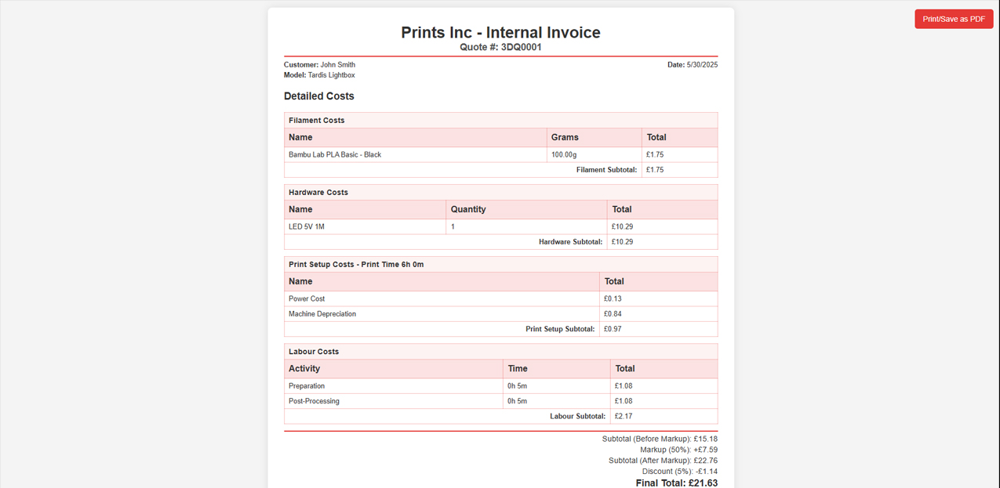

<p align="center">
  
</p>

3DQ is a self-hosted quoting tool for 3D prints.
It helps you calculate quotes for 3D printing jobs by considering filament costs, power usage, printer depreciation, labor, and more.

# Preview






## Features

- **Quick Cost**: Generate fast cost estimates with minimal inputs
- **Quote Builder**: Create detailed quotes with a step-by-step process (general info, filament, hardware, labour, cost summary)
- **Quote History**: View & manage all past quotes
- **HTML Invoices**: Generate client-friendly or detailed internal invoices with optional tax calculation
- **Filament Management**: Configure filament types with pricing and sync with Spoolman
- **Printer Management**: Configure printers with depreciation and power usage calculations
- **Hardware Management**: Configure additional components used in prints (screws, magnets, etc.)
- **Settings**: Configure global settings (electricity cost, labor rate, markup, tax rate, currency, branding, etc.)
- **Customizable Branding**: Personalize with your brand color & name.

## Getting Started

> **Note**: The `/config` directory is mapped to where you want the database and all application data to be saved. This ensures your data persists even when the container is updated or removed.

### Quick Start with Docker

```bash
# Create a directory for persistent data
mkdir -p ~/3dq-data

# Run the container
docker run -d \
  --name 3dq \
  -p 6123:6123 \
  -v ~/3dq-data:/config \
  -e CONFIG_DIR=/config \
  miguel1993/3dq:latest
```

Then access the application at http://localhost:6123

### Docker Compose

Create a `docker-compose.yml` file:

```yaml
version: '3'

services:
  3dq:
    image: miguel1993/3dq:latest
    container_name: 3dq
    ports:
      - "6123:6123"
    volumes:
      - ./data:/config
    environment:
      - CONFIG_DIR=/config
    restart: unless-stopped
```

Then run:

```bash
docker-compose up -d
```

## Security Notice

3DQ was developed with the use of AI technologies (Windsurf with Claude 3.7 Sonnet). We can't verify that best practices were followed nor that the code is free of vulnerabilities.
Therefore we recommend:

- **Local Network Only**: For optimal security, run 3DQ on your local network rather than exposing it directly to the internet
- **Use VPN**: If remote access is needed, consider using a VPN
- **Regular Backups**: Keep regular backups of your database file located in the config directory
- **Updates**: Check for updates regularly as security improvements may be released

## Contributing

Contributions are welcome! Please feel free to submit a Pull Request.

## License

MIT

